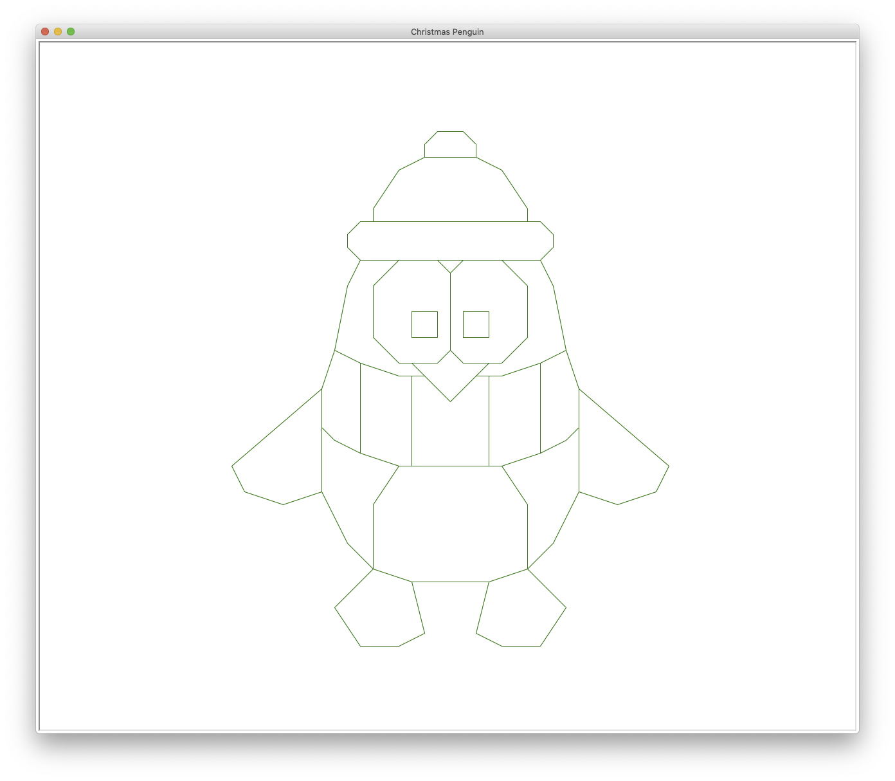

# turtlePointsDrawer

A python3 turtle program that can read points from a file using a regular expression (regex) and then draw lines connecting them up.

The example image is of a Christmas Penguin:-

